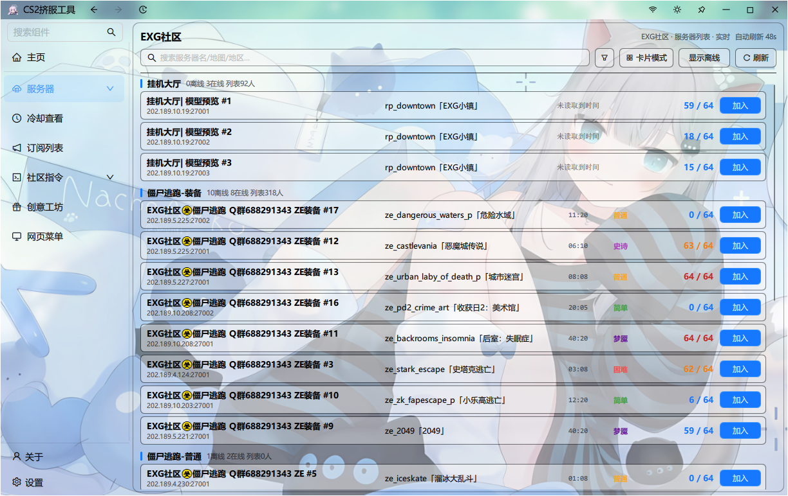

<div align="center">

# CS2 挤服工具

**CS2 僵尸逃跑服务器浏览器 · 自动挤服 · 冷却与订阅管理**

[](../../releases)
[](https://www.qt.io/)
[](#快速开始)
[](#从源码构建)
[](LICENSE)

一个用 **Qt 6 + QML** 编写的 Windows 桌面工具，用于浏览国内各大 CS2 僵尸逃跑（ZE）社区的服务器、查看地图冷却、订阅地图、一键挤服。



</div>

---

## 目录

- [功能特性](#功能特性)
- [快速开始](#快速开始)
- [项目结构](#项目结构)
- [从源码构建](#从源码构建)
- [配置文件](#配置文件)
- [常见问题](#常见问题)
- [免责声明](#免责声明)
- [致谢与许可](#致谢与许可)

---

## 功能特性

###  服务器浏览

- 内置 **8 个社区**，一键切换：

  | 社区 | 说明 |
  | --- | --- |
  | EXG 社区 | 挂机大厅 / 僵尸逃跑-装备 / 普通 / PVE / 活动专用 / 躲猫猫 / 娱乐闯关 |
  | 僵尸乐园（ZED） | 僵尸逃跑、Surf、Bhop、KZ、娱乐对抗等 |
  | UB 社区 | 僵尸逃跑各模式 |
  | 风云社（FYS） | 僵尸逃跑各模式 |
  | UPKK（x 社区 /  ZERO） | 僵尸逃跑 |
  | 星社区 | 感染爆乱等 |
  | 国际服 | 海外僵尸逃跑服务器 |
  | 跑图服 | 地图测试服 |

- 基于 **Valve A2S_INFO 协议**（UDP + challenge 握手）直接查询游戏服务器，不依赖任何网页接口，状态实时准确
- 显示在线状态、当前地图、人数 / 上限、玩家列表
- **自动刷新 + 准确的离线判定**：每轮查询都会重置"等待应答"标记，服务器一旦无响应即被标记为离线，不会出现掉线后仍显示在线的情况
- **地图预览图**：本地内置 680+ 张地图图（`map_images/`），缺失时回退到 Steam 创意工坊预览图
- **地图难度标识**：自动识别简单 / 普通 / 困难 / 极难 / 史诗 / 梦魇 / 绝境并配以颜色
- 订阅标记、隐藏离线服务器、按人数排序
- 服务器卡片右键菜单、复制 IP、直接连接

###  自动挤服

- 多核并发发送连接请求，**间隔 / 人数阈值 / 并发核心数**均可调
- 支持 `+connect`、`steam://connect` 等连接协议
- 右下角悬浮状态框实时显示挤服进度，挤进后弹窗 + 音效提醒

###  冷却查看

- 记录每张地图的冷却结束时间，倒计时显示，到点高亮
- 与社区服务器时间同步（`BaseServerTime`），避免本机时间误差

###  订阅地图

- 订阅关心的地图，服务器上线时优先提示
- 订阅列表持久化保存，可增删

###  社区指令

- 收录各社区常用指令，按 **武器 / 装备 / 杂项 / 作弊指令 / 启动项** 分类
- 支持中英文双语与关键词搜索，一键复制

###  创意工坊

- 扫描本地 Steam 创意工坊目录，管理已订阅的 CS2 地图
- 调用 Steam API 获取工坊条目预览图

###  导航社区 / 网页菜单

- **导航社区**：一键用系统浏览器打开各社区论坛与官网（ZED、EXG、UB、FYS、星社区、UPKK、ZERO、GFL）
- **网页菜单**：内置 WebView2 浏览器浏览服务器列表，也可切换为调用外部浏览器

###  界面

- 基于 [HuskarUI](https://github.com/mengps/HuskarUI) 组件库，Mica / 亚克力 / 液态玻璃等窗口特效
- 三种导航模式：**宽松 / 标准 / 紧凑**
- 自定义背景图与不透明度、深浅主题、主题切换动画
- **导航栏排版**：左侧导航顺序可自由调整（主页固定第一），点击即时生效
- **排版设置**：一张卡片左右两栏 —— 左边调导航顺序，右边调 8 个社区的显示顺序与显隐
- **中英文实时切换**，切换后界面立即重建，无需重启

###  其他

- 启动自动检测新版本（GitHub Releases）
- 加入成功提示音（可自定义音频）、托盘最小化、关闭行为可选
- 主页在线概览：各社区在线服务器 / 玩家数、**在线人数历史柱状图**
- 连接历史记录

---

## 快速开始

### 直接使用

1. 下载选择保留
2. 双击 **`Gallery.exe`**
3. 首次运行会在「**文档 → HuskarUIcs2配置文件**」目录下创建配置文件

> **无需安装 Qt**：发行包已附带全部运行库。
>
> **系统要求**：Windows 10 / 11 64 位。内置浏览器需要 **WebView2 Runtime**（Windows 11 自带；Windows 10 若缺失，可到微软官网下载安装）。

---

## 项目结构

> 本项目由 [HuskarUI](https://github.com/mengps/HuskarUI) 的 `gallery` 示例工程改造而来，因此保留了组件库的示例页面与文档。

```
CS2JoinTool/
├── gallery/                       应用本体
│   ├── cpp/                       C++ 后端
│   ├── qml/                       界面（QML）
│   ├── images/                    应用图标、表情包、帮助图等素材
│   └── shaders/                   背景特效着色器
├── src/                           HuskarUI 组件库（MIT）
├── src_impl/                      无边框窗口代理
├── 3rdparty/                      第三方依赖
├── docs/                          HuskarUI 组件文档
├── map_images/                    地图预览图（680+ 张）
├── preview/                       HuskarUI 预览图
├── resources/                     应用图标资源
├── utils/                         HuskarUI 文档生成脚本
├── agent/                         开发辅助
└── CMakeLists.txt                 顶层构建脚本
```

<details open>
<summary><b>gallery/cpp —— 后端（每个文件的用途）</b></summary>

**服务器查询引擎**（8 个社区各一个，结构一致）

| 文件 | 用途 |
| --- | --- |
| `serverqueryengine.*` | **EXG 社区**服务器查询：挂机大厅 / 僵尸逃跑 / 躲猫猫 / 娱乐闯关等 |
| `zedserverqueryengine.*` | **僵尸乐园（ZED）**服务器查询，含域名解析与去重 |
| `ubserverqueryengine.*` | **UB 社区**服务器查询 |
| `fysserverqueryengine.*` | **风云社（FYS）**服务器查询 |
| `upkkserverqueryengine.*` | **UPKK（x 社区 / 零次元社 ZERO）**服务器查询 |
| `starserverqueryengine.*` | **星社区**服务器查询 |
| `internationalserverqueryengine.*` | **国际服**服务器查询 |
| `maprunserverqueryengine.*` | **跑图服**服务器查询 |
| `playerqueryengine.*` | 玩家列表查询（A2S_PLAYER），用于服务器详情面板 |

**核心功能**

| 文件 | 用途 |
| --- | --- |
| `main.cpp` | 程序入口：注册 QML 类型、初始化配置目录、托盘、单实例锁、语言切换时重建引擎 |
| `squeezeengine.*` | **自动挤服核心**：并发连接、间隔控制、人数阈值判定 |
| `baservertime.*` | 与社区服务器同步时间，供冷却倒计时使用 |
| `mapcooldownmanager.*` | **地图冷却**记录、倒计时与状态计算 |
| `mapsubscriptionmanager.*` | **地图订阅**的增删与持久化 |
| `maptranslator.*` | **地图数据库**：中文名映射 + 难度识别（数据量最大的文件） |
| `workshopmanager.*` | 创意工坊地图扫描与管理 |
| `workshoppreviewmanager.*` | 通过 Steam API 获取工坊地图预览图 |
| `webview2browser.*` | **内置 WebView2 浏览器**（动态加载 WebView2Loader.dll） |
| `browsercontroller.*` | WebView2 的生命周期与窗口绑定管理 |
| `updatechecker.*` | **版本检测**：查询 GitHub Releases 并比较版本号 |
| `langmanager.*` | **中英文切换**（`Lang.tr('中文','English')`） |
| `joinhistorymanager.*` | 连接历史记录 |
| `onlinehistorymanager.*` | 各社区在线人数历史（主页柱状图数据源） |
| `backgroundfilemanager.*` | 自定义背景图的导入与缓存 |
| `appconfig.*` | 轻量配置读写（`appconfig.ini`） |
| `customtheme.*` / `themeswitchitem.*` | 自定义主题与主题切换动画 |
| `datagenerator.*` | 列表演示数据生成 |
| `creator.*` / `creator_p.h` | 项目模板生成器（HuskarUI 遗留功能，内含 CMake/QML 模板） |
| `wheelExporter.*` | 轮盘导出 |

</details>

<details open>
<summary><b>gallery/qml —— 界面（每个页面的用途）</b></summary>

**根文件**

| 文件 | 用途 |
| --- | --- |
| `Gallery.qml` | 主窗口：导航菜单、页面路由、`appSettings`（全部设置项）、托盘、单实例 |
| `Global.qml` | 菜单模型构建、更新检查、搜索索引、导航顺序应用 |

**Home 页面**

| 文件 | 用途 |
| --- | --- |
| `Home/HomeMainPage.qml` | **主页**：在线概览、各社区统计、在线人数柱状图、连接记录 |
| `Home/SettingsPage.qml` | **设置**：排版设置、语言、背景、主题、音效、挤服参数、更新检查 |
| `Home/AboutPage.qml` | 关于页（工具信息、技术信息、开源致谢） |
| `Home/HomePage.qml` | HuskarUI 示例首页 |
| `Home/OverviewPage.qml` | 组件总览 |
| `Home/CreatorPage.qml` | 项目创建器 |

**Examples/Server（本项目的核心界面）**

| 文件 | 用途 |
| --- | --- |
| `ExpServerList.qml` | EXG 社区服务器列表页 |
| `ExpServerListZed/Ub/Fys/Upkk/Star/International/MapRun.qml` | 其余 7 个社区的服务器列表页 |
| `ServerCard.qml` | 服务器卡片：预览图、地图、人数、难度、订阅标记、加入按钮 |
| `ServerContextMenu.qml` | 卡片右键菜单（复制 IP、连接、订阅等） |
| `ServerPlayersPanel.qml` | 服务器玩家列表面板 |
| `SqueezePanel.qml` | **挤服面板**：间隔、阈值、核心数、进度、悬浮框 |
| `CooldownPage.qml` | **冷却查看**页 |
| `SubscriptionPage.qml` | **订阅列表**页 |
| `CommandsListPage.qml` | **社区指令**页（含中英文指令库） |
| `WorkshopPage.qml` | **创意工坊**页 |
| `BrowserPage.qml` | **网页菜单**（内置 WebView2 / 外部浏览器） |
| `RadialWheelPage.qml` | 轮盘功能与帮助 |

**Controls**：`CodeBox` / `CodeRunner` / `CommitHistory` / `Description` / `DocDescription` / `GradientFlowEffect` / `ThemeToken` / `Thumbnail` / `UpdateDesc` —— 自研控件，供示例页与更新说明使用

**Examples/**：其余为 HuskarUI 组件示例页（DataDisplay / DataEntry / Feedback / General / Layout / Navigation / Theme / Utils 等），保留以便查阅组件用法

</details>

<details>
<summary><b>src / src_impl / 3rdparty —— 组件库与依赖</b></summary>

| 路径 | 说明 |
| --- | --- |
| `src/cpp/` | HuskarUI 控件 C++ 实现（图标字体、二维码、水印、树模型、主题生成器…） |
| `src/imports/` | 60+ 个 QML 组件（按钮 / 输入 / 表格 / 弹窗 / 菜单 / 轮播…），其中 `HusMenu.qml` 是侧边导航 |
| `src/resources/` | 图标字体、主题 JSON、图片资源 |
| `src/shaders/` | 液态玻璃、评分等着色器 |
| `src_impl/` | 无边框窗口代理（封装 qwindowkit） |
| `3rdparty/qwindowkit/` | 无边框窗口支持（git submodule，Apache-2.0） |
| `3rdparty/QR-Code-generator/` | 二维码生成（git submodule，MIT） |
| `3rdparty/webview2/include/` | WebView2 SDK 头文件（Microsoft） |

</details>

---

## 从源码构建

### 环境要求

| 依赖 | 版本 |
| --- | --- |
| Qt | **6.8.3**（MinGW 64-bit） |
| 编译器 | MinGW-w64（GCC 13+） |
| CMake | ≥ 3.21 |
| Ninja | 任意较新版本（或改用其他生成器） |

### 构建步骤

```bash
git clone --recursive https://github.com/hualiangHL/CS2JoinTool.git
cd CS2JoinTool

cmake -S . -B build -G Ninja -DCMAKE_PREFIX_PATH=<你的 Qt 路径，如 C:/Qt/6.8.3/mingw_64>
cmake --build build --parallel
```

产物为 `bin/Gallery.exe`。若需直接分发，请用 `windeployqt` 补齐 Qt 运行库。

> [!IMPORTANT]
> **源码路径不要包含中文、空格或括号。** MinGW 的 `windres` 处理这类路径会失败，典型报错：
> ```
> cc1.exe: fatal error: \(2\)/3rdparty/...: No such file or directory
> ```
> 请把源码放到 `C:\CS2JoinTool` 这类纯英文路径下再编译。

---

## 配置文件

所有用户数据都保存在「**文档 → HuskarUIcs2配置文件**」目录（不污染程序目录）：

| 文件 | 内容 |
| --- | --- |
| `MenPenS/HuskarUI.ini` | 全部设置项：主题、背景、导航模式、**导航栏顺序**、**社区排序**、挤服参数、音效、关闭行为等 |
| `appconfig.ini` | 轻量配置：界面语言、排序偏好 |
| `subscriptions.ini` | 地图订阅列表 |
| `online_history.json` | 各社区在线人数历史（主页柱状图） |
| `qml_log.txt` | 运行日志（排查问题时看这个） |
| `WebView2Cache/` | 内置浏览器缓存（可安全删除） |

> 想恢复默认设置，退出程序后删除整个 `HuskarUIcs2配置文件` 目录即可。

---

## 常见问题

<details>
<summary><b>网页菜单空白 / 提示缺少 WebView2</b></summary>

安装 [WebView2 Runtime](https://developer.microsoft.com/microsoft-edge/webview2/)（Windows 11 已内置）。也可以在设置里勾选「用外部浏览器打开」绕过。
</details>

<details>
<summary><b>服务器显示在线，但实际已经关了</b></summary>

4.4.4 及更早版本存在这个 bug：查询引擎只在第一轮重置状态标记，导致超时清理逻辑后续再未执行，掉线的服务器会一直停留在"在线"。**4.4.5 已修复**——现在每轮查询都会重新计数，无响应的服务器会被立即标记为离线，并与外部 A2S 查询结果做过交叉验证。
</details>

<details>
<summary><b>编译时报 <code>cc1.exe: fatal error: \(2\)/...</code></b></summary>

源码路径含中文 / 空格 / 括号，MinGW 无法处理。换到纯英文路径即可，详见 [从源码构建](#从源码构建)。
</details>

<details>
<summary><b>挤服功能会把服务器打崩吗？</b></summary>

挤服的本质是快速重试连接，频率由「间隔」参数控制，默认值对服务器无影响。**请勿把间隔调到极小后长时间运行**，那属于对服务器的恶意请求。
</details>

---

## 免责声明

- 本工具仅用于方便玩家查看与进入社区服务器，**严禁用于任何形式的服务器攻击或恶意刷请求**。
- 工具中立：服务器信息均来自各社区公开的查询接口，与本工具作者无关。
- 地图预览图、社区名称与商标归各自社区 / 原作者所有。

---

## 致谢与许可

本项目的界面框架来自开源组件库 **[HuskarUI](https://github.com/mengps/HuskarUI)**（作者 [@mengps](https://github.com/mengps)），在此致谢。

| 项目 | 许可 |
| --- | --- |
| [HuskarUI](https://github.com/mengps/HuskarUI) | MIT |
| [qwindowkit](https://github.com/stdware/qwindowkit) | Apache-2.0 |
| [QR-Code-generator](https://github.com/nayuki/QR-Code-generator) | MIT |
| Qt Framework | LGPL-3.0 / 商业许可 |
| Microsoft WebView2 SDK | Microsoft 许可 |

本项目遵循 **MIT License**，详见 [LICENSE](LICENSE)。

<div align="center">
<br>
<sub>如果这个工具帮到了你，欢迎点个 ⭐ Star</sub>
</div>
